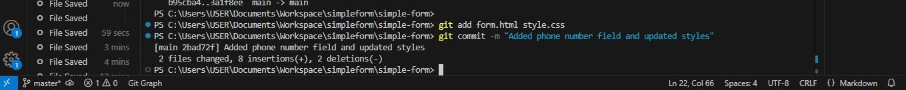

### Tasks
- Clone the existing GitHub repository called simple-form to your local machine:
    > git@github.com:Akinpersie/simple-form.git
-   existing github repository

-   cloning

- Stage the Form File
    - Place the client's HTML form file (form.html) and CSS (style.css) in this folder and save
 

- Use Git to add the form.html and style.css files to the staging area:
    > git add form.html style.css

- Commit Your Initial Version:
    - Commit the staged files with a message:
        > git commit -m "Initial commit for simple form"
.
- Push the initial commit to the remote repository:
    >  git push origin main

+ Make and Track Changes:
    + Your client requests some updates to the form. You modify form.html to include an additional field for a phone number and update the styling in style.css.
    + After making these changes, stage and commit the updated files with a message:
    > git add form.html style.css
    > git commit -m "Added phone number field and updated styles"

+ Push Changes to GitHub:
    + Push your latest changes to the remote repository:
    > git push origin main

+ View the Project’s History:
    + After working on several features and fixes, view the Git history to check all the changes you've made:
    > git log

- Revert to a Previous Version:
    - Your client realizes that one of the previous changes introduced a bug in the form submission process. You need to revert form.html to the last working version. First, find the commit hash of the last working version using git log, then run:
    > git checkout <commit-hash> -- form.html
    > git checkout 3a1f8ee6eb66c3286ea7f52fde6e6e650f44c2a3 -- form.html
- Branching for New Features:
    - Your client wants to experiment with adding a CAPTCHA feature to the form. Create a new branch called feature-add-captcha and switch to it:
    > git checkout -b feature-add-captcha

- Make the necessary changes for the CAPTCHA feature, then stage and commit them:
    > git add form.html

         git commit -m "Added CAPTCHA feature"

- Merge the changes back into the main branch:
> git checkout main
   
    git merge feature-add-captcha

- Push Merged Changes to GitHub:
    - After merging, push the updated main branch to the remote repository:
    > git push origin main

- Undoing Local Changes:
    - You accidentally made some unwanted changes to style.css that you haven’t committed yet. Discard these local changes and revert the file to its previous state:
    > git checkout -- style.css

    